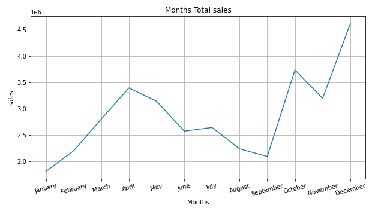
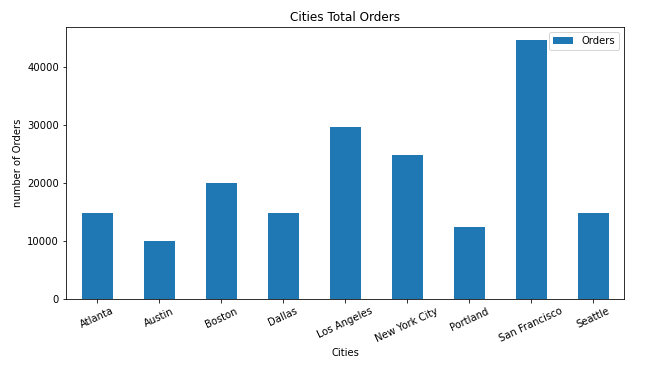
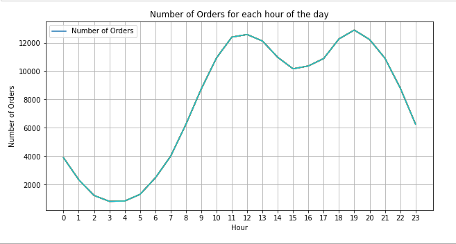
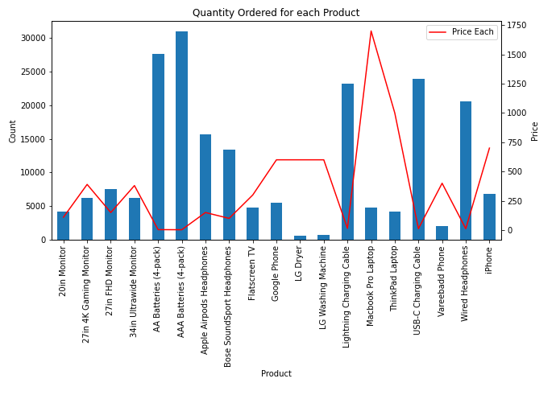

  
This data is for an electronics shop, it contains sales for year 2019, a csv file for each month. 
Each dataset consists of 6 columns ['Order ID', 'Product', 'Quantity Ordered', 'Price Each', 'Order Date', 'Purchase Address'] 
This notebook contains visualizations and answers to some questions based on the provided data.

# Data Preprocessing
1. Concatenating all 12 dataframes.
2. Changing columns type.
3. drop missing Values.
4. Obtain Hour from `Order Date` column
5. Extract Cities and States from `Purchase Address`.

# Explanatory Visualizations
NOTE: Comments on the graphs are in the notebook.
*  Q1: What was the best month for sales?

* Q2: Which City had the largest number of orders?

* Q3: What time should the shop display advertisments to maximize liklihood of cutomer's buying products?

*  Q4: Which product is sold the most?

